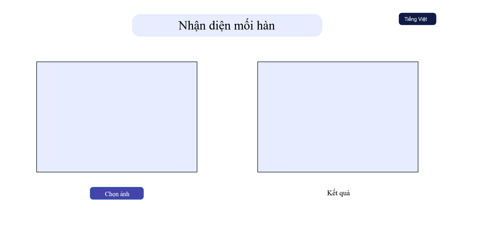
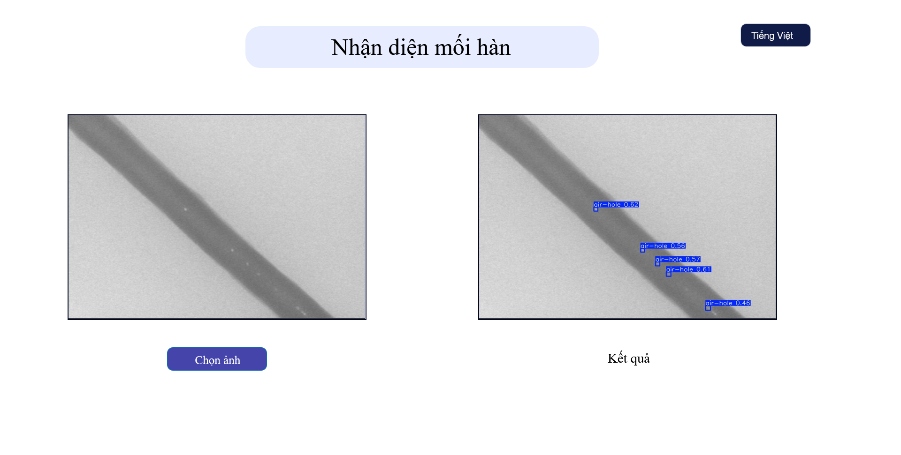

# Web UI for Weld Failure Detection

## About

A simple web interface with Python and Flask for ML-DM course capstone project demo.

## Installation

Clone the repo to your machine.

Make a new virtual environment with [venv](https://docs.python.org/3/library/venv.html) or [conda]( https://repo.anaconda.com/miniconda/Miniconda3-latest-Windows-x86_64.exe). Activate the virtual environment, and run the following command to install all dependencies:

```bash
python -m pip install -r requirement.txt
```

## HOWTO

Change the working directory into the repo and run the web interface:

```bash
python server.py
```

Open browser, go to `localhost:5000`, it should show the UI:



Choose an image from the path `Images/steel-tube-dataset-all/yolo/images/val2021`, wait a minute, the outcome will be displayed on the web UI:



